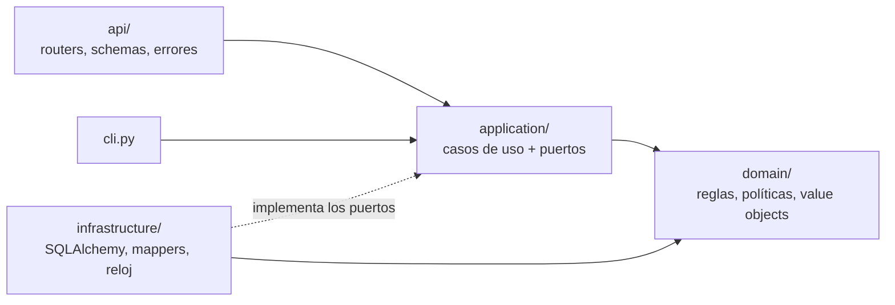

# Servicio de evaluación de crédito

Servicio HTTP que evalúa solicitudes de crédito según la política de cada producto (PHONE, TWIST y CARD), guarda cada decisión con sus motivos y permite reevaluar cuando cambian los umbrales.

El enunciado original está en [`docs/ENUNCIADO.md`](docs/ENUNCIADO.md).

**Stack:** Python 3.11, FastAPI, SQLAlchemy 2, Pydantic 2, Alembic, pytest, Hypothesis, Docker.

---

## Cómo correrlo

Solo se necesita Docker. Los comandos son los mismos del enunciado.

```bash
docker compose up --build          # API en http://localhost:8000, docs en /docs
docker compose run --rm app pytest -v
```

Al arrancar, el contenedor aplica las migraciones pendientes. La base SQLite vive en un volumen (`db-data`), así que los datos sobreviven a reinicios. Para empezar de cero: `docker compose down -v`.

### Ejemplo rápido

```bash
curl -X POST http://localhost:8000/applications \
  -H 'content-type: application/json' \
  -d '{"amount": 1200000, "monthly_income": 2000000, "employment_months": 24,
       "external_score": 540, "product": "CARD"}'
```

```json
{
  "id": "b3a544a6-4507-4ca5-b78a-22844f812c2c",
  "product": "CARD",
  "status": "REJECTED",
  "reasons": [
    {"code": "SCORE_BELOW_MINIMUM", "message": "El score 540 es menor al mínimo de 550",
     "details": {"minimum": 550, "actual": 540}},
    {"code": "INCOME_BELOW_MINIMUM", "message": "El ingreso mensual de 2000000.00 COP es menor al mínimo de 3000000.00 COP",
     "details": {"minimum": "3000000.00", "actual": "2000000.00"}}
  ],
  "installment": "100000.00",
  "installment_to_income": "0.0500",
  "policy": {"name": "Agresiva", "version": 1},
  "created_at": "2026-09-29T12:40:07.482687Z",
  "updated_at": "2026-09-29T12:40:07.482687Z"
}
```

(La respuesta también incluye los datos originales de la solicitud.)

### Cambiar un umbral y reevaluar (bonus)

```bash
# 1. Publicar una versión nueva de la política (la anterior queda intacta)
docker compose exec app python -m app.cli publish-policy TWIST --name Estándar \
  --rules '{"all_of": [{"min_score": 650}, {"max_installment_to_income": "0.35"}]}'

# 2. Reevaluar una solicitud con la versión vigente
curl -X POST http://localhost:8000/applications/<id>/reevaluate

# 3. Ver el historial completo: qué versión decidió qué y cuándo
curl http://localhost:8000/applications/<id>/evaluations
```

## Endpoints

| Método | Ruta | Qué hace |
|---|---|---|
| `POST` | `/applications` | Evalúa, guarda y devuelve la decisión (201 + `Location`) |
| `GET` | `/applications/{id}` | Una solicitud por id (404 si no existe) |
| `GET` | `/applications?status=&product=&limit=&offset=` | Listado, más recientes primero. Todos los filtros son opcionales |
| `POST` | `/applications/{id}/reevaluate` | Reevalúa con la política vigente (bonus) |
| `GET` | `/applications/{id}/evaluations` | Historial de evaluaciones de la solicitud |
| `GET` | `/health` | Estado del servicio |

Los errores usan el formato [RFC 7807](https://www.rfc-editor.org/rfc/rfc7807) (`application/problem+json`).

## Reglas de evaluación

| Producto | Política | Regla |
|---|---|---|
| PHONE | Conservadora | `score ≥ 700` AND `employment_months ≥ 12` AND `cuota ≤ 25 % ingreso` |
| TWIST | Estándar | `score ≥ 600` AND `cuota ≤ 35 % ingreso` |
| CARD | Agresiva | `score ≥ 550` OR (`score ≥ 500` AND `monthly_income ≥ 3.000.000`) |

La cuota es `amount / 12`, como fija el enunciado.

Cada política es **configuración, no código**. Así se ve CARD en la base de datos:

```json
{"any_of": [
  {"min_score": 550},
  {"all_of": [{"min_score": 500}, {"min_monthly_income": 3000000}]}
]}
```

Una fábrica convierte ese JSON en un árbol de reglas pequeñas (`MinScore`, `MinEmploymentMonths`, `MaxInstallmentToIncome`, `MinMonthlyIncome`) combinadas con `AllOf` y `AnyOf`. Elegir la política de un producto es buscar en un diccionario o en una tabla, sin `if/elif`. Cambiar un umbral o agregar un producto no requiere tocar código. Ver [ADR 0002](docs/adr/0002-politicas-como-datos.md).

## Arquitectura



```
app/
├── domain/            # Python puro: no conoce FastAPI ni SQLAlchemy
│   ├── value_objects.py   # Money (Decimal), Score, InstallmentRatio
│   ├── entities.py        # CreditRequest
│   ├── applications.py    # CreditApplication, Evaluation
│   ├── policies.py        # Policy, PolicyCatalog
│   └── rules/             # reglas atómicas, AllOf/AnyOf y la fábrica desde JSON
├── application/       # casos de uso y puertos (interfaces)
├── infrastructure/    # adaptadores: SQLAlchemy, unidad de trabajo, mappers, settings
├── api/               # FastAPI: routers, DTOs, errores, límite de peticiones
├── cli.py             # publicar versiones de políticas
└── main.py            # create_app(): arma todo
alembic/versions/      # 0001 tablas + políticas v1 · 0002 índices · 0003 historial inmutable
tests/
├── unit/              # dominio y casos de uso (con adaptadores en memoria)
├── integration/       # repositorios, migraciones e índices contra SQLite real
└── api/               # HTTP de punta a punta
```

El dominio no depende de nada, y los casos de uso dependen de puertos (`UnitOfWork`, `ApplicationRepository`, `PolicyRepository`, `Clock`). Los mappers de `infrastructure/db/mappers.py` son la **capa anticorrupción** entre las tablas y el dominio. Los DTOs de `api/schemas.py` cumplen el mismo papel frente a HTTP: ninguno de los dos lados se filtra al otro. Esta estructura difiere de la sugerida en el enunciado; la justificación está en [ADR 0001](docs/adr/0001-arquitectura-por-capas.md).

## Decisiones que vale la pena mencionar

- **Nada de floats para dinero.** `Money` usa `Decimal`. La regla de cuota compara `cuota ≤ ingreso × proporción`, que es una multiplicación exacta, en lugar de dividir y arriesgar redondeos justo en el límite.
- **Todas las razones de rechazo, no solo la primera.** `AllOf` evalúa todas sus reglas. Cada motivo tiene un código estable, un mensaje y los números concretos.
- **Historial inmutable.** Cada evaluación guarda la versión de política que la produjo. La base rechaza `UPDATE` y `DELETE` sobre `evaluations` mediante triggers. Ver [ADR 0003](docs/adr/0003-historial-de-solo-insercion.md).
- **Validación estricta.** `"700"` o `true` no pasan como números, los campos desconocidos se rechazan y hay topes para los montos. Además, la base tiene `CHECK` constraints como segunda línea de defensa.
- **UUID como identificadores**, para que las solicitudes no se puedan recorrer de a una.
- **Tests de propiedades con Hypothesis.** Para cualquier solicitud se verifica que un mejor perfil (más score, más ingreso o menos monto) nunca convierta una aprobación en rechazo.

### Índices

Cada combinación de filtros del listado tiene un índice cuyo prefijo coincide con el `WHERE` y cuyo final coincide con el `ORDER BY created_at DESC, id DESC`:

```
EXPLAIN QUERY PLAN SELECT id FROM applications
 WHERE status = 'APPROVED' AND product = 'TWIST'
 ORDER BY created_at DESC, id DESC LIMIT 100;

SEARCH applications USING COVERING INDEX ix_applications_status_product_created (status=? AND product=?)
```

No aparece `USE TEMP B-TREE`, es decir, no hay ordenamiento en memoria. `tests/integration/test_indexes.py` falla si algún filtro deja de usar su índice.

## Seguridad

Lo que está implementado:

- Validación estricta de entrada y topes de montos.
- Errores sin trazas ni detalles internos. En los errores de validación se indica el campo, pero no se repite el valor enviado.
- Límite de peticiones por IP: 30 escrituras y 120 lecturas por minuto. Al superarlo, la respuesta es 429 con `Retry-After`.
- Contenedor con usuario sin privilegios.
- Consultas solo mediante el ORM, con parámetros enlazados (sin SQL armado a mano).
- `pip-audit` en CI. Encontró 16 vulnerabilidades en las versiones del esqueleto (Starlette 0.41.3 y pytest 8.3.3), que se corrigieron actualizando.

Lo que falta para producción:

- **El `external_score` lo envía el cliente.** Así lo define el enunciado, pero en la vida real alguien podría mandar `1000` y aprobarse solo. El siguiente paso sería un puerto `ScoreProvider` con un adaptador al buró (Datacrédito o TransUnion) que traduzca su formato al value object `Score`: otra capa anticorrupción, esta vez frente al proveedor externo.
- **Autenticación y autorización** (OAuth2/JWT con roles). Ver [ADR 0005](docs/adr/0005-que-quedo-fuera.md).
- Si el servicio queda detrás de un proxy, configurar `--forwarded-allow-ips` para que el límite por IP use la IP real del cliente.
- TLS en el borde, cifrado en reposo y cumplimiento de la Ley 1581 de 2012 (Habeas Data).

## Configuración

Todo se configura con variables de entorno (o con un archivo `.env`):

| Variable | Por defecto | Para qué |
|---|---|---|
| `DATABASE_URL` | `sqlite:///./credit_eval.db` (en Docker: `/data/credit_eval.db`) | Conexión a la base |
| `RATE_LIMIT_ENABLED` | `true` | Activa el límite de peticiones |
| `RATE_LIMIT_WRITE` | `30/minute` | Límite de `POST` por IP |
| `RATE_LIMIT_READ` | `120/minute` | Límite de `GET` por IP |
| `RATE_LIMIT_STORAGE_URI` | `memory://` | Con varias réplicas: `redis://...` |

## Desarrollo sin Docker

```bash
python3.11 -m venv .venv && source .venv/bin/activate
pip install -r requirements-dev.txt
alembic upgrade head
uvicorn app.main:app --reload

ruff check . && ruff format --check . && mypy && pytest   # lo mismo que corre el CI
pre-commit install                                        # opcional
```

## Qué quedó fuera

Algunas mejoras se descartaron a propósito porque cambiaban lo que pide el enunciado: rutas, fórmula de la cuota, acceso sin token o la forma de levantar el proyecto. Son autenticación JWT, versionado `/api/v1`, plazo y tasa reales, PostgreSQL, paginación por cursor y un frontend. En [ADR 0005](docs/adr/0005-que-quedo-fuera.md) está por qué se descartó cada una y cómo se haría sin romper nada.
